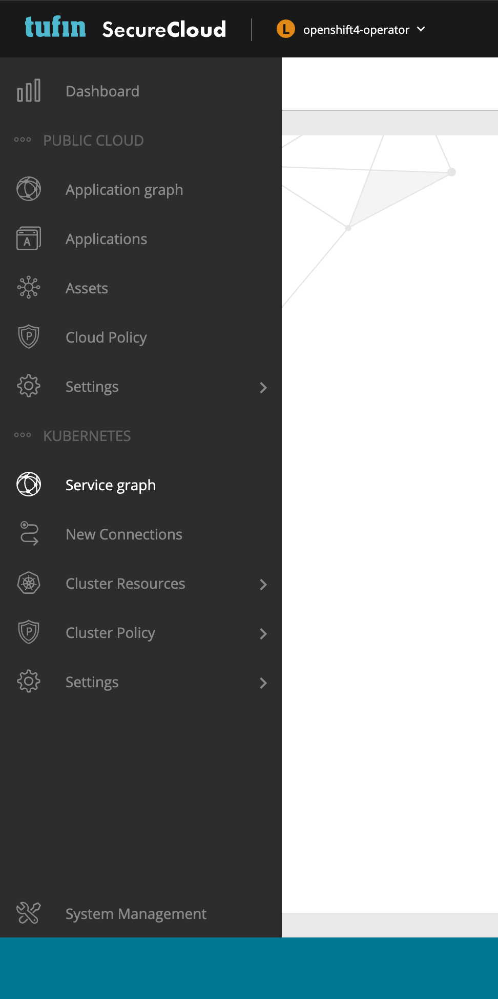
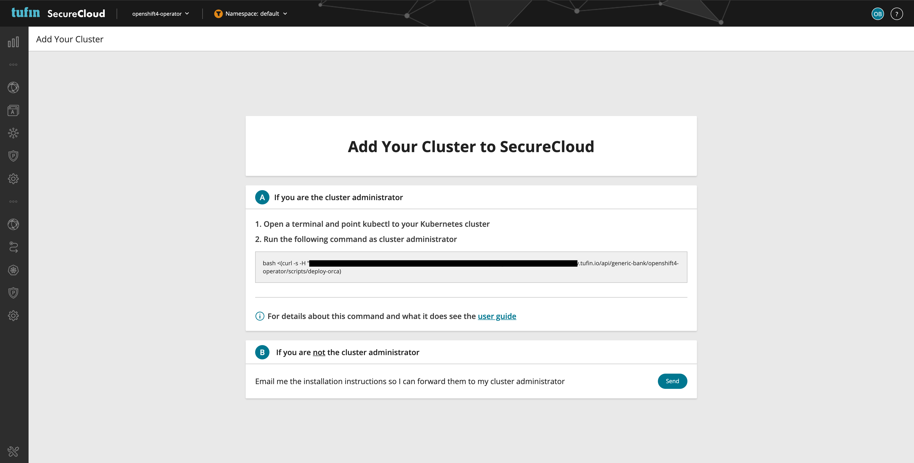
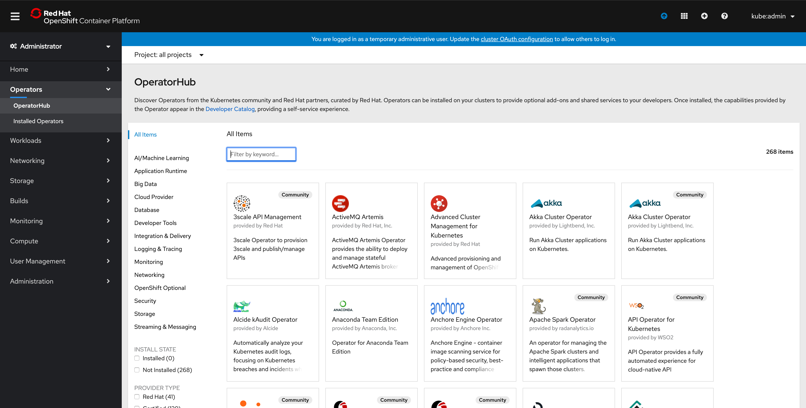
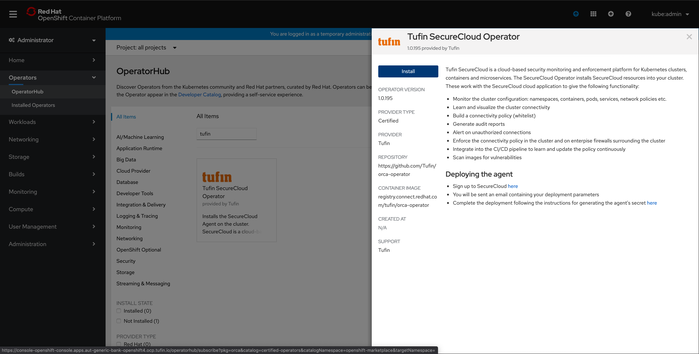
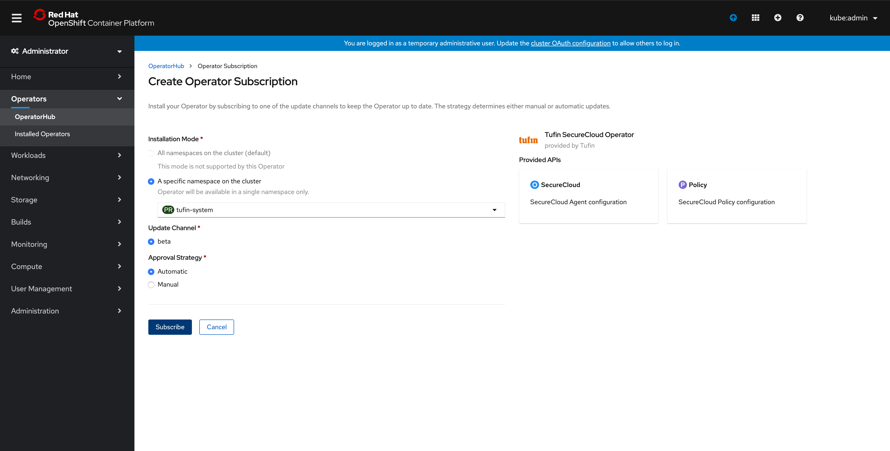
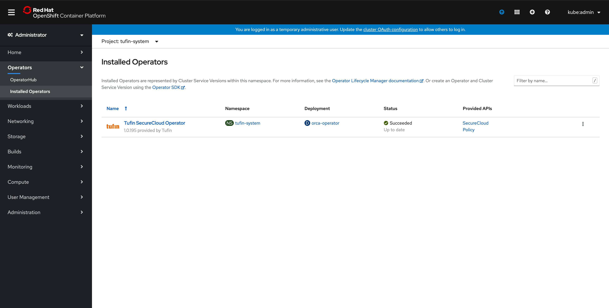
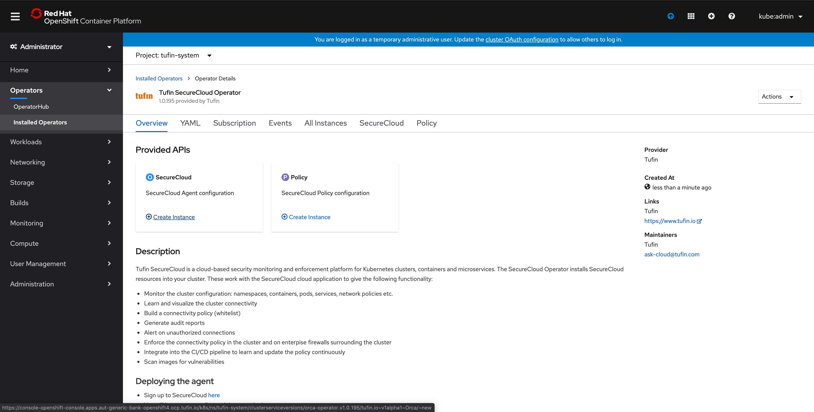
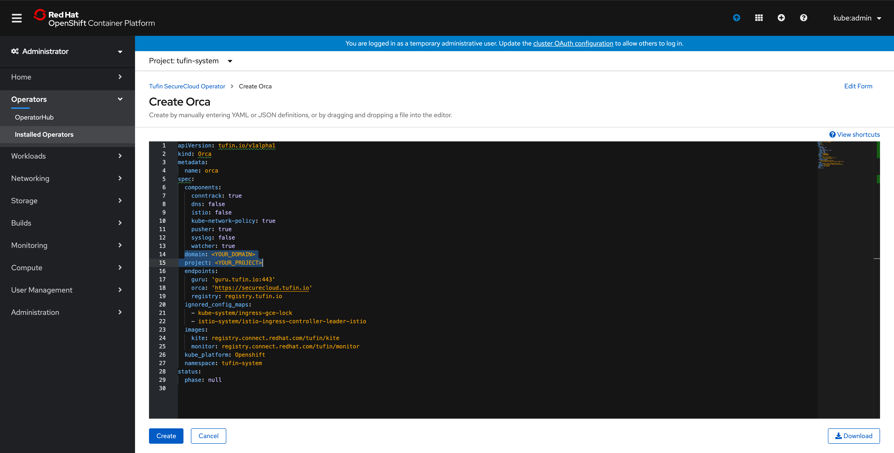
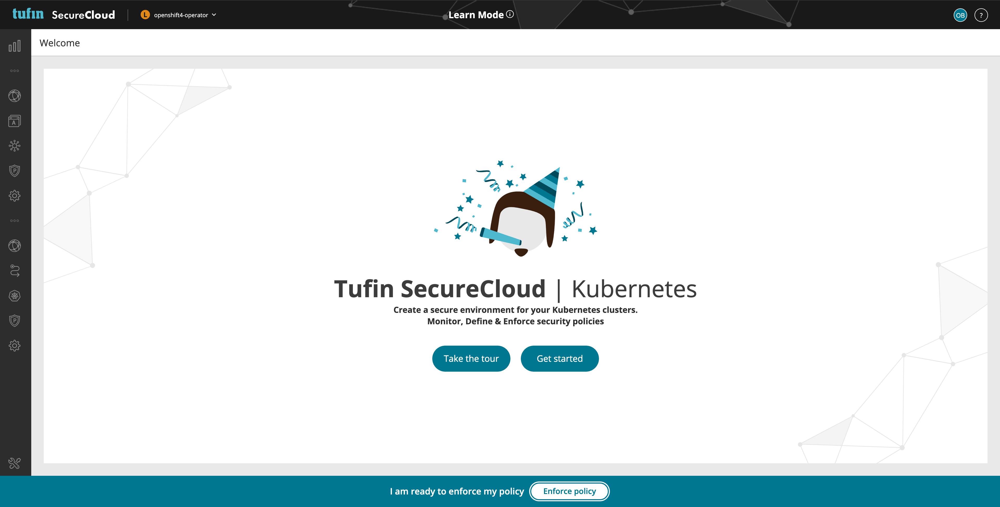

# Installing SecureCloud operator on Openshift

## Get your credentials from the SecureCloud API
##### The SecureCloud installation requires some secrets - do the following to get them:
1. Log in to your SecureCloud Account and navigate to one of the **Kubernetes** links in the side menu

2. Copy the `installation command`

3. Run the command in `DRY MODE` by adding the argument `--dry-run true` like so:
```bash
bash <(curl -s -H "Authorization: Bearer <API_TOKEN>" https://<ACCOUNT>.securecloud.tufin.io/api/<ACCOUNT>/<PROJECT>/scripts/deploy-orca) --dry-run true
```
4. When the dry-run is finished, the folder `bash-kite-installer` will be created with the credentials in it.

We will soon use one of the files generated in that folder.

## Prepare A namespace for the operator installation
##### It is highly recommended to create a dedicated namespace for the operator
1. Create a namespace with the name `tufin-system`
```bash
oc create ns tufin-system
```
2. Add an annotation to that namespace
```bash
 oc annotate namespace tufin-system openshift.io/node-selector=""
```
3. Add your SecureCloud credentials (if you chose a different `namespace` name - you first have to edit the `namespace` field in the secret YAML file)
```bash
 oc apply -f bash-kite-installer/.tmp/kite/kite.secret.yaml      
```

## Install the SecureCloud operator
1. Log in to the `Openshift Container Platform` console and navigate to the **OperatorHub** link under `Operators` in the navigation menu

2. Search for `tufin` and selected the operator, click the **install** button

3. Select the namespace you created in the previous section and click the **subscribe** button

4. The operator will now be installed, click on the **SecureCloud** operator

5. In the `Provided APIs` section, click on **Create instance** under the `SecureCloud` API

6. Fill in the `Domain` (Account) and `Project` fields and click the **Create** button

7. You will soon be directed to the next view in the SecureCloud Kubernetes UI


The installation process is now finished! Welcome to SecureCloud :)

