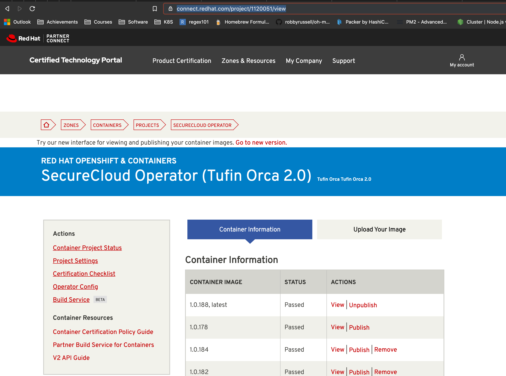
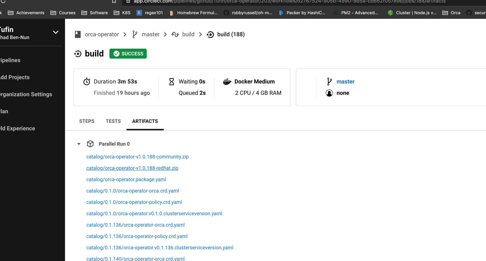
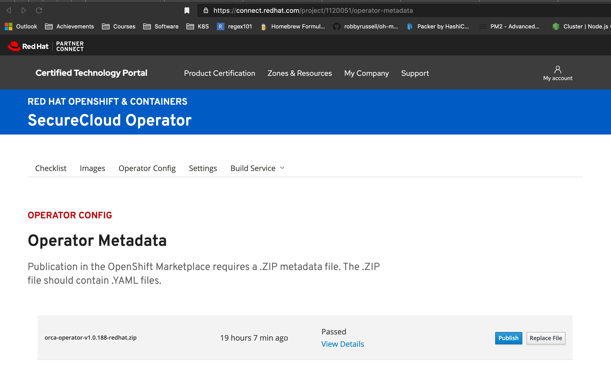

# How to publish a new version to RedHat Openshift market \ OLM

### To publish the operator in Openshift, we need to do the following:
1. push a new version of the operator to `RedHat repository`
2. upload (manually) the new generated `redhat` catalog archive (CSV)
3. publish (manually) the new Operator version in the `Operator Market`

### 1. Push operator to `RedHat repository`
when pushing to the repo, there are 2 command available. a command is added as a suffix to the commit message: 
1. `[push csv]` - will push into `github` the new generated CSV
2. `[push redhat]` - will upload the new operator image to the `RedHat repository`

When creating a new version, both actions need to be used as follows:
`git commit -m "My new commit [push csv][push redhat]"`

### 2. Upload the new CSV (Operator Metadata) & Publish the new operator version

#### 1. Publish the new operator version
1. Navigate & login to the [RedHat connect portal](https://connect.redhat.com/project/1120051/view)
2. Navigate to the `Container information` page, wait for the image scan to end & publish the new version by pressing `Publish`

#### 2. Publish the new operator CSV
After the CI build is finished, the CI will save the artifacts of the build:

1. Download the `redhat` archive named `orca-operator-v<NEW_VERSION>-redhat.zip`
2. Navigate & login to the [RedHat connect portal](https://connect.redhat.com/project/1120051/operator-metadata)
3. Under the `Operator Metadata` page, replace the CSV with the new one by pressing `Replace file`

4. The CSV will now be scanned, this process can take up to a few hours
5. After the scan is completed - the `Publish` button will be enabled - publish the new CSV by clicking it
